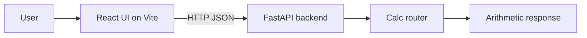

# Python FastAPI Calculator

Small calculator app with a FastAPI backend and a Vite + React frontend.

## Project Instructions

Use [PROJECT_INSTRUCTIONS.md](PROJECT_INSTRUCTIONS.md) for repo-specific
workflow, edit scope, environment variables, and validation rules.

## Architecture



## Features

- FastAPI arithmetic endpoints
- React calculator UI with keyboard support
- Configurable frontend API base URL
- Dockerized backend runtime
- Pytest coverage for the API
- Dependabot, CI, and code scanning workflows

## API

### Health

```http
GET /health
```

Response:

```json
{ "status": "healthy" }
```

### Arithmetic

```http
POST /api/v1/calc/add
POST /api/v1/calc/subtract
POST /api/v1/calc/multiply
POST /api/v1/calc/divide
```

Request body:

```json
{ "a": 2, "b": 3 }
```

Example response:

```json
{ "a": 2, "b": 3, "result": 5 }
```

## Local Development

### Backend

```bash
python -m venv .venv
source .venv/bin/activate
pip install -r requirements.txt
uvicorn app.main:app --reload
```

### Frontend

```bash
cd frontend
npm install
npm run dev
```

The frontend reads the backend origin from `frontend/.env`:

```bash
VITE_API_BASE_URL=http://localhost:8000
```

If you run the backend on a different host or port, update this value in
`frontend/.env` or `frontend/.env.example`.

Keyboard shortcuts:

- Number keys and `.` enter values
- `Enter` or `=` calculates
- `+`, `-`, `*`, `/` select operations
- `Backspace` deletes the last digit
- `Escape` resets the calculator

## Tests and Quality

```bash
pytest -q
black --check app tests
ruff check app tests
mypy app
```

## Docker

```bash
docker build -t fastapi-calculator .
docker run -p 8000:8000 fastapi-calculator
```

## Docker Compose

```bash
docker compose up -d --build
```

## Screenshots

Add UI screenshots here once the frontend design is finalized. The current frontend is a full calculator interface with a history panel and server-backed calculations, so screenshots should capture the updated layout and keyboard-driven flow.

## Contributing

1. Open an issue for a bug or feature.
2. Create a branch from `main`.
3. Keep changes focused and covered by tests when possible.
4. Run the backend quality checks and the frontend build before opening a PR.

See [CONTRIBUTING.md](CONTRIBUTING.md) for the full contributor workflow.

## Roadmap

- Add more calculator operations and input validation
- Add persistent UI state and better error handling
- Add release tagging and changelog entries
- Add screenshots and a short product walkthrough
- Expand API and frontend automated tests
